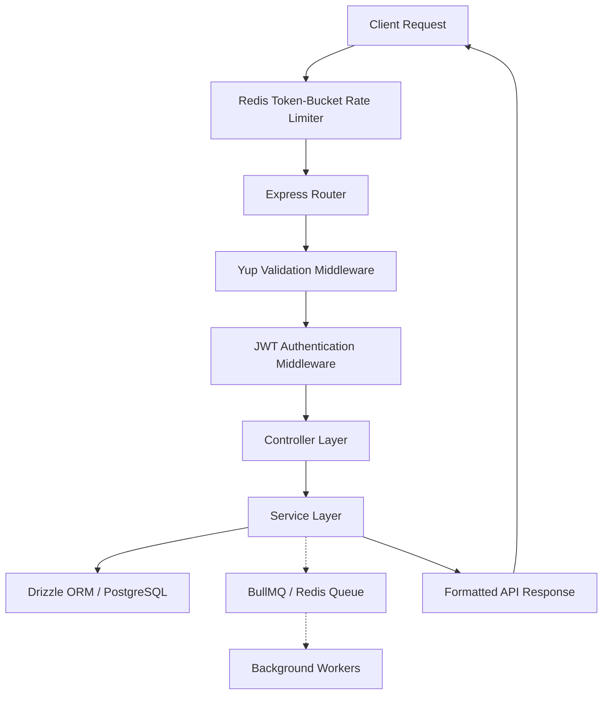

# CodeSM — Backend Architecture & API Flow Guide

Welcome to the **CodeSM Backend** architecture blueprint. This project is a highly scalable, production-ready backend built with **TypeScript**, running on the high-performance **Bun** runtime. It uses **Express** for handling HTTP requests, **PostgreSQL** with **Drizzle ORM** for database management, **Redis** for rate-limiting, and **BullMQ** for background job queue processing.

This guide provides an in-depth breakdown of the directory structure, the API request-response flow, and design patterns so that you can **easily reuse this architecture in other projects**.

---

## 🚀 Architectural Overview

The backend is built around a **Modular, Feature-Based 3-Tier Architecture**. Rather than grouping files by technical layer (e.g., placing all controllers in a global `controllers/` folder), code is organized by **domain/feature module** (e.g., `auth`, `problem`, `submission`). 

This maximizes cohesion, decouples features, simplifies codebase navigation, and makes individual domains highly portable for reuse.



---

## 📁 Directory Structure

Here is a visual map of the backend's directory structure with detailed explanations of each layer's role:

```text
backend/
├── src/
│   ├── config/                     # Strict Config & Environment Validation
│   │   └── index.ts                # Validates & exports process.env variables via Yup
│   ├── loaders/                    # Startup Decoupling (App Bootstrappers)
│   │   ├── express.ts              # Sets up Express middlewares, CORS, global routing
│   │   ├── googleOAuth.ts          # Initializes Google OAuth configuration
│   │   ├── index.ts                # Main loader orchestrator (runs at server start)
│   │   ├── logger.ts               # Winston logging setup (with daily rotation in production)
│   │   ├── postgres.ts             # Instantiates PG Pool and Drizzle ORM client
│   │   ├── queue.ts                # Registers BullMQ Queues (e.g., runQueue, submitQueue)
│   │   └── redis.ts                # Establishes connection to Redis
│   ├── api/                        # Feature-based Domain Modules
│   │   ├── auth/                   # Self-contained Auth Module
│   │   │   ├── auth-route.ts       # Route endpoints, schemas & middleware bindings
│   │   │   ├── auth-controller.ts  # Req/Res handlers, cookie setup, HTTP statuses
│   │   │   ├── auth-service.ts     # Business logic (DB queries, Google OAuth verify)
│   │   │   ├── auth-schema.ts      # Yup schemas for body/query validation
│   │   │   ├── auth-types.ts       # Module-specific type definitions
│   │   │   └── auth-helper.ts      # Helper utilities specific to Auth (e.g., setAuthCookies)
│   │   ├── problem/                # Self-contained Problem Module (similar structure)
│   │   ├── submission/             # Self-contained Submission Module (similar structure)
│   │   ├── interview/              # Self-contained AI-Interview Module
│   │   └── index.ts                # Routes orchestrator (mounts modules under /api/v1)
│   ├── services/                   # Cross-cutting Infrastructure Services
│   │   ├── ai.service.js           # Gemini API Integration
│   │   ├── aws.service.js          # S3 presigned URLs and file uploads
│   │   └── email/                  # Nodemailer setups
│   ├── shared/                     # Globally Shared Middlewares & Utils
│   │   ├── middleware.ts           # Validation & JWT middlewares
│   │   └── ratelimiter.ts          # Custom Redis-based Token-Bucket Rate Limiter
│   ├── utils/                      # Helper Utilities & Core Decorators
│   │   ├── ApiError.ts             # Custom class for standard API errors
│   │   ├── ApiResponse.ts          # Consistent JSON response formatter
│   │   └── asyncHandler.ts         # Wrapper to eliminate try/catch boilerplate in controllers
│   ├── types/                      # Global TypeScript Type definitions
│   └── index.ts                    # Application entry point & graceful shutdown handler
├── .env.example                    # Environment template
├── drizzle.config.ts               # Drizzle migration config
└── package.json                    # Dependencies & Bun run scripts
```

---

## 🔄 The 3-Tier Layered Flow (Inside a Module)

Each domain folder under `src/api/` follows a strict linear flow to ensure separation of concerns:

### 1. The Route Layer (`*-route.ts`)
Declares endpoints and strictly chains middlewares. It specifies **which inputs to validate**, **which authentication rules to apply**, and **which controller function should handle the logic**.

*Example (`src/api/auth/auth-route.ts`):*
```typescript
router.post(
  "/register", 
  validate('body', emailPasswordRegisterSchema), // 1. Validate payload
  emailPasswordRegister                          // 2. Pass to controller
);
```

### 2. The Controller Layer (`*-controller.ts`)
Acts as the bridge between HTTP and your application. **It should never contain SQL queries or complex business decisions.**
* **Inputs**: Receives Express `req.body`, `req.query`, or headers.
* **Service Call**: Invokes the dedicated service function.
* **Outputs**: Returns a clean JSON payload using consistent status codes.
* Uses the `asyncHandler` decorator to automatically catch errors and pass them to the global error middleware.

*Example (`src/api/auth/auth-controller.ts`):*
```typescript
export const emailPasswordRegister = asyncHandler(async (req: Request, res: Response) => {
    // 1. Call Service Layer
    const result = await handleEmailPasswordRegister(req.body);

    // 2. Return standard HTTP response
    res.status(httpStatus.CREATED).json({
        success: true,
        message: result.message,
    });
});
```

### 3. The Service Layer (`*-service.ts`)
The **brain** of your application.
* Implements core business rules (e.g. hashing passwords, calling third-party APIs).
* Talks directly to the database via **Drizzle ORM** (`db`).
* Dispatches async tasks to background workers via **BullMQ**.
* Throws custom `ApiError`s if something goes wrong (which are handled gracefully by the middleware).
* **Decoupled from Express**: It doesn't know about `req` or `res`, making it perfectly unit-testable and reusable.

*Example (`src/api/auth/auth-service.ts`):*
```typescript
export const handleEmailPasswordRegister = async (data: RegisterInput) => {
    const existingUser = await db.select().from(userTable).where(eq(userTable.email, data.email));
    if (existingUser.length > 0) {
        throw new ApiError('Email already registered', httpStatus.CONFLICT);
    }
    
    // Hash password & insert into DB
    const hashedPassword = await bcrypt.hash(data.password, 10);
    const [newUser] = await db.insert(userTable).values({ ...data, password: hashedPassword }).returning();
    
    return { message: 'Registration successful', userId: newUser.id };
};
```

---

## 🌊 Complete API Request-to-Response Flow

To see how everything glues together, let's trace a **code submission** request:

1. **Rate Limiting**: The request hits `rateLimitMiddleware` (`src/shared/ratelimiter.ts`). It queries **Redis** to check if the authenticated user has exceeded their token capacity. If they have, it returns an HTTP `429 Too Many Requests`.
2. **Routing & JWT Verification**: The router (`src/api/submission/submission-route.ts`) matches `/api/v1/submission/:problemId/submit` and runs `verifyJWT`. It decodes the Authorization header, retrieves the user's record from PostgreSQL, and attaches it to `req.user`.
3. **Request Validation**: The `validate` middleware processes `req.body` using the Yup schema defined in `submission-schema.ts`. If keys are missing or invalid, it returns `400 Bad Request`.
4. **Controller Routing**: The `createSubmission` controller (`submission-controller.ts`) is called. It parses the validated inputs and calls `handleCreateSubmission` in the service layer.
5. **Database & Queue Dispatch**: 
   * The service layer inserts a pending record into the `submissions` table using **Drizzle**.
   * It schedules a background execution job by adding the task to `submitQueue` using **BullMQ**.
   * BullMQ pushes this serialized task into **Redis**, where a separate background worker package (located in `/workers`) picks it up to compile and run the code safely in a sandbox.
6. **Instant Response**: The service returns a pending receipt. The controller wraps it in a standard response schema and returns HTTP `201 Created` immediately. The frontend can now poll or listen for updates via WebSocket/SSE while the worker executes in the background.

---

## 🛠️ Key Architectural Patterns & Best Practices

Here are the premium patterns implemented in this codebase that you can adapt to any new project:

### ⚙️ Strict Environment Validation
To prevent the app from launching in an unstable or misconfigured state, **Yup** validations run synchronously inside `src/config/index.ts` during server startup. If a vital variable (like `DATABASE_URL` or `REDIS_URL`) is missing, the server crashes instantly with a clean report instead of failing mysteriously at runtime.

### 🔌 Decoupled Startup (The Loader Pattern)
Instead of cluttering `index.ts` with hundreds of setup lines for MongoDB, Postgres, CORS, Routing, and Passport, the application utilizes a modular **Loader Pattern** (`src/loaders`).
* The main loader (`src/loaders/index.ts`) orchestrates the initialization sequence asynchronously.
* Adding a new technology (e.g. WebSockets, Meilisearch) is as simple as creating `src/loaders/search.ts` and calling it in the orchestrator.

### 🛡️ Graceful Shutdowns
When a termination signal is received (e.g. `SIGTERM` or `SIGINT` during deployment updates), the app doesn't just terminate abruptly. It gracefully closes open HTTP connections, terminates the PostgreSQL Pool, waits for outstanding transactions to complete, and exits cleanly.

### 🚀 Shared DB Schema Package
The database schema (`db-schema`) is structured as a **separate workspace package** (`"db-schema": "file:../db-schema"`). This allows you to share database types, schemas, and relation definitions across the `backend`, background `workers`, and any other microservices in your repository without duplicating code.

---

## 📋 Blueprint: How to Reuse this Architecture in a New Project

To spin up a new backend using this exact architecture:

1. **Setup Folder Structure**:
   ```bash
   mkdir -p src/{api,config,loaders,services,shared,utils,types}
   ```
2. **Configure Package Manager**: Use Bun for development. Install structural dependencies:
   ```bash
   bun add express drizzle-orm pg ioredis bullmq yup http-status dotenv winston
   bun add -d typescript @types/express @types/node @types/pg drizzle-kit
   ```
3. **Copy Utility files**:
   * Copy `ApiError.ts`, `ApiResponse.ts`, and `asyncHandler.ts` to `src/utils/`.
   * Copy `middleware.ts` (with `validate` function) to `src/shared/`.
4. **Bootstrap Loaders**:
   * Implement database loader (`src/loaders/postgres.ts`).
   * Implement server loaders (`src/loaders/express.ts` and `src/loaders/index.ts`).
5. **Implement Feature Modules**:
   * Create a directory in `src/api/<feature>` for every new business module.
   * Write its `*-route.ts`, `*-controller.ts`, `*-service.ts`, `*-schema.ts`, and `*-types.ts`.
   * Register the route in `src/api/index.ts`.
